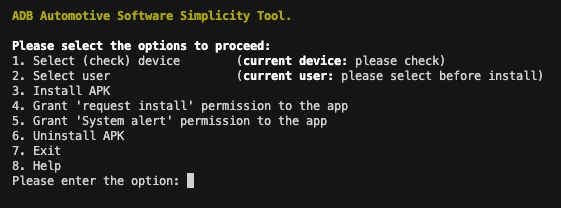

# ADB Automotive Software Installation Simplicity Tool (ADB-ASIST)

[](

[](LICENSE)

## Project Description

This project implements application management via *Python* script with any Android device using adb-tools via a **direct USB connection**. Please note that remote IP connection and authorization are currently not supported.

The project is designed to simplify applications installation and management on an Android device, as well as to simplify the process of granting permissions to installed applications.



### Functionality

The project offers the following functionality:

1. Checking the connection to the device
2. Selecting the user for whom all operations will be performed (or optionally for all users)
3. Installing applications
4. Granting the installed applications (packages) the right to request (install) applications on behalf of the package (application)
5. Allowing installed applications (packages) to display messages on top of others (system alert)
6. Uninstalling applications

The script is designed primary for interaction with automotive devices to facilitate interaction with the device, but can be used to work with any Android device that supports interaction via ADB without authorization.

It was done on Python 3.11 and tested on **MacOS**.

where is NO ANY external dependencies inside the script. Only general adb-tools - you need it in any way if you plan to install or remove apps on some android device.

## Table of Contents

- [Installation](#installation)
- [Usage](#usage)
- [Contributing](#contributing)
- [License](#license)
- [Contact](#contact)

## Installation

1. Install *HomeBrew* as an package manager to make all the stuff easer:
```
/bin/bash -c "$(curl -fsSL https://raw.githubusercontent.com/Homebrew/install/HEAD/install.sh)"
```
2. Install *Android ADB Tools*:
```
brew install android-platform-tools
```
3. Install *Python*:
```
brew install python
```
4. Make the folder where you want to work (f.e. `~/MyAutoApps`), go in and clone this repo:
```
git clone...
```

## Usage

1. Go to the repo folder (where it was cloned to)
2. Download apps (apk files) to the `../toInstall` folder
3. Connect to the android device via USB
4. Run the script - `python3 adb-asist.py`
5. Enjoy :)

## Contributing

Everbody welcome to improve any part of the repo

## License

This project is licensed under the [MIT License](LICENSE).

## Contact

- [GitHub](https://github.com/GrayStranger)
